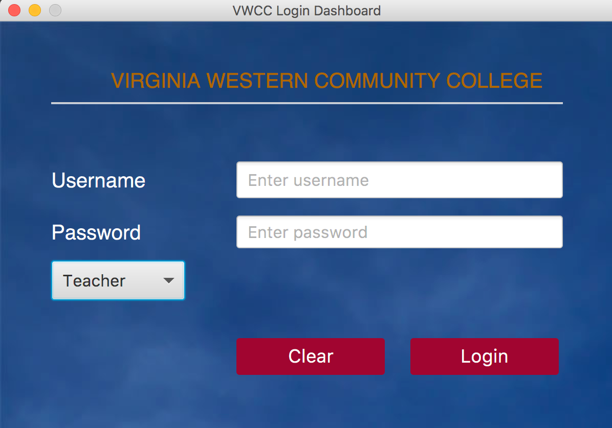

# VWCCS (Virginia Western Community College)

**JavaFX Application With FXML, and JDBC**

**Purpose**  
> VWCCS is a javaFX application with beautiful UI (User Interface) design for Teacher, 
Students and Admin to be able to use to login and send grade, submit assignment, export 
data to excel, edit information and etc. The application is simple to use and simple to 
navigate around. The application has four main pages, Login, 
Teacher, Student and Admin pages.

**Important Note**
- IDE use: Intellij IDEA
- JDK use: jdk 8 or highest
- Interface was design using javafx scene builder 2.0

**Start Up** 
>The application can only be lunch from Main class which fxml file is the Login.fxml 

